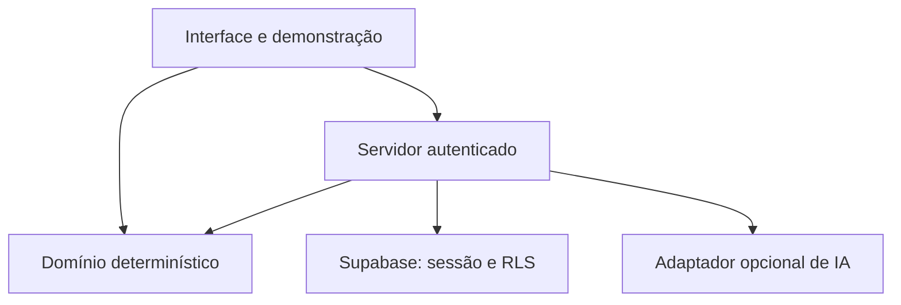

# Arquitetura

## Decisão

Um aplicativo **Astro 7/TypeScript com ilhas React** reúne interface, endpoints, domínio determinístico e acesso ao Supabase. A escolha substitui a proposta inicial da especificação por instrução posterior do usuário. Tailwind suporta estilos; Zod valida entradas; Vitest testa domínio e integração; Playwright testa navegador. As dependências efetivas e suas versões estão em `package.json` e no lockfile. Não há microserviços, banco vetorial ou sistema multiagente no produto.

A demo usa fixtures sintéticas e o mesmo motor; não usa acesso ao banco privado. IA pode produzir rascunhos, nunca o resultado do motor. Projetos são de um proprietário nesta versão.

## Camadas

| Caminho | Responsabilidade |
| --- | --- |
| `src/pages/` | Páginas Astro e wrappers HTTP dos endpoints |
| `src/views/` | Telas React hidratadas como ilhas |
| `src/layouts/Base.astro` | Documento HTML, navegação assistiva e layout |
| `src/components/` | Formulários, relatório e apresentação |
| `src/pages/api/` | Wrappers `APIRoute` que recebem Request e delegam aos handlers |
| `src/server-api/` | Handlers privados independentes de roteamento; identidade verificada no servidor |
| `src/domain/framework/` | Tipos, validação, constantes, decisão, economia e fixtures |
| `src/lib/supabase/` | Clientes e acesso autorizado à persistência |
| `supabase/` | Configuração local, migrações e dados sintéticos |
| `tests/unit`, `tests/ai`, `tests/integration`, `tests/e2e` | Verificações separadas por responsabilidade |

Veja [traceability.md](traceability.md) para arquivos e regras exatos. Os testes de domínio não importam cliente Supabase nem dependem de rede/IA.

## Modelo de persistência

| Modelo lógico | Armazenamento | Observação |
| --- | --- | --- |
| `Project` | `oaas_projects` | Identidade, proprietário, estágio e rascunho |
| `Evidence` | `oaas_evidence` e referências em snapshot | Texto/metadados; URL não é buscada pelo servidor |
| `Assessment` | `oaas_assessments` | Dados e resultados versionados, imutáveis após finalização |
| `CriterionAssessment` | Snapshot JSONB tipado | Oito critérios; não confundir com scorecard |
| `BlockAssessment` | Snapshot JSONB tipado | Seis blocos e pesos próprios |
| `GateAssessment` | Snapshot JSONB tipado | Quatro travas com fundamentação/revisão |
| `EconomicsScenario` | Dados tipados/snapshot JSONB | Período/coorte/moeda/unidade preservados |
| `Experiment` | `oaas_experiments` | Plano editável vinculado ao projeto |
| `AuditEvent` | `oaas_audit_events` | Metadados mínimos de ações, sem conteúdo sensível indiscriminado |

JSONB mantém uma avaliação completa coerente e evita dezenas de tabelas para estruturas versionadas do MVP. Validação do domínio e limites de entrada continuam necessários. Normalização adicional exigirá migração e preservação dos snapshots.

## Fronteiras de confiança

O navegador não define o proprietário. O servidor verifica token/sessão, resolve a identidade e restringe operações ao usuário. Políticas RLS reforçam o acesso por proprietário inclusive para referências filhas. IDs válidos de terceiros não autorizam leitura, escrita ou exportação. Não existe runtime com chave administrativa para ignorar RLS.

Rascunho mutável e avaliação finalizada são objetos distintos. O servidor deve calcular a avaliação a partir dos dados validados; não confiar em resultado calculado pelo navegador. Atualizações posteriores criam outro snapshot. A imutabilidade de negócio não impede exclusão do projeto pelo proprietário segundo a política de retenção.

## Alternativas e decisões

- [ADR-001](adr/001-deterministic-core.md): domínio determinístico, IA opcional, versões e limites.
- [ADR-002](adr/002-local-first-and-publication.md): desenvolvimento local, publicação condicionada e bloqueio inicial de cota Free.
- [ADR-003](adr/003-authorized-shared-supabase.md): destino compartilhado posteriormente autorizado, namespace próprio e limites de isolamento.
- [ADR-004](adr/004-astro-sites-cloudflare.md): Astro com ilhas React e servidor Cloudflare em Sites privado.

O resultado efetivo de aplicação/deploy remoto está em `STATUS.md`. PGlite pode testar SQL/RLS sem Docker; sua cobertura não inclui serviço de autenticação ou rede Supabase. Consulte [testing.md](testing.md).

## Implantação compartilhada autorizada

As tabelas/funções públicas usam prefixo `oaas_`; contadores internos ficam em `oaas_private`. Objetos existentes de outros produtos não fazem parte da migração. Auth e recursos da instância continuam compartilhados; não há garantia de isolamento de carga/disponibilidade. Não mudar configuração global de Auth ou schemas expostos para este MVP.

## Build e runtime

`astro.config.mjs` configura saída de servidor, `@astrojs/react` e `@astrojs/cloudflare`. O build gera assets em `dist/client` e entrada de servidor `dist/server/index.js` com handler fetch do Worker. `wrangler.jsonc` descreve assets e compatibilidade do runtime; o comando local `start` usa a configuração produzida em `dist/server/wrangler.json`. O alvo atual não é servidor Node em container.

A rota `/` abre diretamente o avaliador demonstrativo; `/demo` é uma entrada equivalente. Conta, redefinição de senha, lista de projetos, projeto individual e metodologia permanecem em `/conta`, `/conta/redefinir`, `/projetos`, `/projetos/[id]` e `/metodologia`. Variáveis públicas usam prefixo `PUBLIC_`; módulos de servidor são impedidos de entrar no bundle do navegador pelo limite configurado no build.

Preservar as assinaturas dos handlers ao portar testes não demonstra por si só comportamento no Worker. A homologação precisa de tipos, testes, build, navegador e validação do runtime Astro/Cloudflare; o resultado efetivo fica em STATUS.
